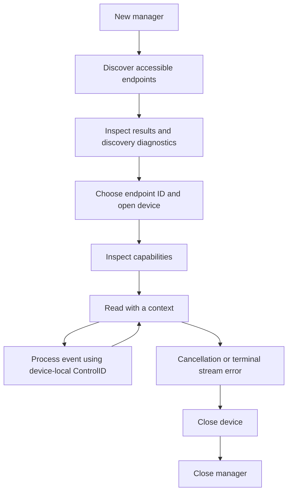

# goinput

A Go library for discovering input devices and reading keyboard, mouse, gamepad,
and other supported input events through one API on Linux, macOS, and Windows
(`amd64` and `arm64`). Platform selection happens through build tags.

The API is read-only. Input injection, text composition, output reports, LEDs,
force feedback, exclusive grabs, and hotplug subscriptions are outside its scope.

## Installation

Use Go **1.26.6 or newer**, as required by [go.mod](go.mod).

```sh
go get github.com/gostafa/goinput
```

## Quick start

From a checkout, list accessible input endpoints:

```sh
go run ./examples/capture
```

Copy an endpoint ID from the output and read its events:

```sh
go run ./examples/capture -duration 10s "device-id"
```

Omit `-duration` to read until Ctrl-C. To exercise repeated capture lifecycles and
shared native sessions:

```sh
go run ./examples/capture -cycles 2 -managers 2 -duration 2s "device-id"
```

See [the capture example](examples/capture/funcs.go) for a complete program with
signal cancellation, capability lookup, and cleanup.

## Recommended API flow



1. Create a manager with `goinput.New(goinput.Options{})`. The default buffer is
   256 events per device; a negative `BufferSize` is invalid. Construction starts
   no native resources. Construct managers through `New`; do not copy them or use
   their zero value.
2. Call `manager.Devices(ctx)`. Discovery can return both accessible endpoints and
   an error containing partial diagnostics. Inspect both; an empty list is valid.
3. Choose an endpoint and call `manager.Open(ctx, info.ID)`. IDs describe current
   OS endpoints and can be reused after disconnection. A physical device may expose
   multiple endpoints; names, paths, and vendor/product pairs are not unique IDs.
4. Read `device.Capabilities()` and index controls by `Control.ID`. HID usages
   describe semantics but can occur more than once on a device. Check `Complete`
   and each control's `Support` before assuming a capability is available.
5. Call `device.Read(ctx)` in a loop. Process events promptly so the bounded queue
   can keep up. Cancellation ends that read, not the device's lifetime.
6. Close the device and manager on every exit path, normally with `defer`. Close
   is idempotent and unblocks pending readers.

Concurrent readers on one device consume a shared queue; they are not separate
subscriptions. Separate `Open` calls create independent streams. If an application
needs broadcast delivery, have one reader distribute events to its consumers.

Managers lease a shared native session. The last manager to close shuts it down;
later managers can start another session. If the native event loop fails, close
all managers leasing that session before constructing a replacement.

## Event semantics

| Input | Interpretation |
| --- | --- |
| Keys and buttons | Physical controls, values `0`/`1`, with press/release/observed-repeat actions |
| Absolute axes | Logical positions; `Control.Normalize(value)` returns `[0,1]` only for a valid absolute range |
| Relative axes | Deltas, not persistent positions |
| Scrolling | Fractional detents when scaling is known; otherwise counts, indicated by `Control.Unit` |
| Conventional hats | `HatNeutral` (`-1`) or directions `0..7`, clockwise from north |

Normalization does not infer a center or deadzone. Unsupported hat encodings stay
logical axes. Gamepad button ordinals do not guarantee a physical button layout.
Missing metadata and unknown enum values remain explicit; metadata snapshots are
defensive copies.

`Event.Timestamp.Time` is the source event time; `ReceivedAt` is host receipt time
and retains Go's monotonic component. Consult `Timestamp.Source`: native or
estimated times do not guarantee monotonicity, hardware latency, or ordering
across devices. The API exposes no portable native report/frame boundary.

## Error handling and recovery

Use `errors.Is(err, goinput.ErrEventLoss)` and the other sentinels to classify
errors. Use `errors.As` with `*goinput.OpError` for operation and device context.

| Error | Recommended response |
| --- | --- |
| `context.Canceled` / `context.DeadlineExceeded` | End the read or retry with a new context if the stream is still needed |
| `ErrPermissionDenied` | Check OS permissions for the endpoint |
| `ErrNotFound` / `ErrDisconnected` | Discover again and select an accessible endpoint |
| `ErrEventLoss` | Close and reopen the device; rebuild application input state explicitly |
| `ErrClosed` | Stop using the closed device or manager |
| `ErrRegistrationConflict` | Resolve ownership of Windows Raw Input registrations in the host process |
| `ErrUnsupported` | Check platform or feature support |
| `ErrInvalidOptions` | Correct the manager options |

Queue overflow or native event loss terminates the affected stream and discards
pending events. Increasing the buffer can absorb bursts, but cannot restore lost
events. There is no automatic reconnect, synthetic release, or motion recovery.

Only explicitly transient discovery failures are retried, with four attempts and
a shared 500 ms budget. Capture startup, registration, delivery, reads, and close
are not retried. Synchronous native calls may outlast context cancellation until
they return.

## Platform requirements

| Platform | Backend | Requirements and caveats |
| --- | --- | --- |
| Linux | evdev | Read access to `/dev/input/event*`; capability snapshots may be incomplete and HID mappings are inferred. `SYN_DROPPED` ends the stream. |
| macOS | IOHID | Input Monitoring permission for protected input; the library does not request consent. Keyboard repeat is unavailable. Mach timestamps are aligned to a host anchor and marked estimated. |
| Windows | Raw Input | Process-wide ownership per top-level usage is required for active streams. Conflicting host registrations fail. Event timestamps use receipt time; RDP devices may be absent. |

On Linux, arrange appropriate device access for the account running the application.
On macOS, grant Input Monitoring access through system settings when required.
On Windows, coordinate Raw Input ownership with other components in the same
process. Windows supports scalar HID inputs up to 32 bits; usage-value arrays are
unsupported. On macOS, reopen after external scroll-resolution feature changes;
an unreadable multiplier leaves scroll values in counts.

## Native metadata extensions

Optional typed native metadata lives in [extensions/evdev](extensions/evdev),
[extensions/iokit](extensions/iokit), and [extensions/win32](extensions/win32).
Type-assert a device to `goinput.ExtensionProvider`, then pass a pointer to a
supported extension struct to `Extension`. Unknown targets return `false`.
Native binding types remain private.

## Architecture

| Location | Responsibility |
| --- | --- |
| Root package | Public API, portable types, and error translation |
| `internal/domain` | Internal models and portable semantics |
| `internal/application` | Managers, session leases, and bounded event streams |
| `internal/ports` | Application-owned interfaces implemented by adapters |
| `internal/adapters` | Native backends, retry policy, and session coordination adapters |
| `internal/implementation` | Runtime composition and wiring |
| `internal/platform` | Build-selected backend registration |
| `extensions` | Optional public native metadata |
| `examples/capture` | Discovery and capture command |

Keep OS bindings behind adapters and build tags. Keep application logic dependent
on domain models and ports. Preserve the public API's portable semantics when
adding backend features. Package files generally group declarations in `types.go`,
`consts.go`, and `vars.go`, behavior in `funcs.go`, and package docs in `doc.go`.

## Development workflow

1. Start a focused branch and describe the behavior being changed.
2. Update the relevant layer and keep native types out of the public API. Add
   meaningful tests for changed behavior, especially cancellation, teardown,
   event loss, and partial discovery.
3. Format and run the baseline checks from the repository root:

   ```sh
   go fmt ./...
   go test ./...
   go vet ./...
   ```

4. For backend changes, build and exercise capture on the affected OS and
   architecture. Host-only checks do not validate other native backends. Verify
   permission failures, disconnects, and repeated open/close lifecycles where relevant.
5. Review the diff, update API docs and examples, and submit a pull request with
   the behavior change, validation results, and any platform limitations.

The [CI workflow](.github/workflows/main.yml) sets up TaskOtter and Task, applies
automated fixes, runs checks, and uploads coverage and test results. Once its
generated task tooling is available locally, the corresponding commands are:

```sh
task taskotter:ci
task taskotter:go-junit-report:report
```

These tasks require that setup; they are not provided by a plain checkout alone.
The [lint configuration](.golangci.yml) includes custom module linters, so a stock
`golangci-lint` installation may not reproduce CI. Baseline Go checks are only part
of validation; consult the configured CI tooling for the full check suite.

## License

[MIT](LICENSE), copyright 2026 Gostafa.
